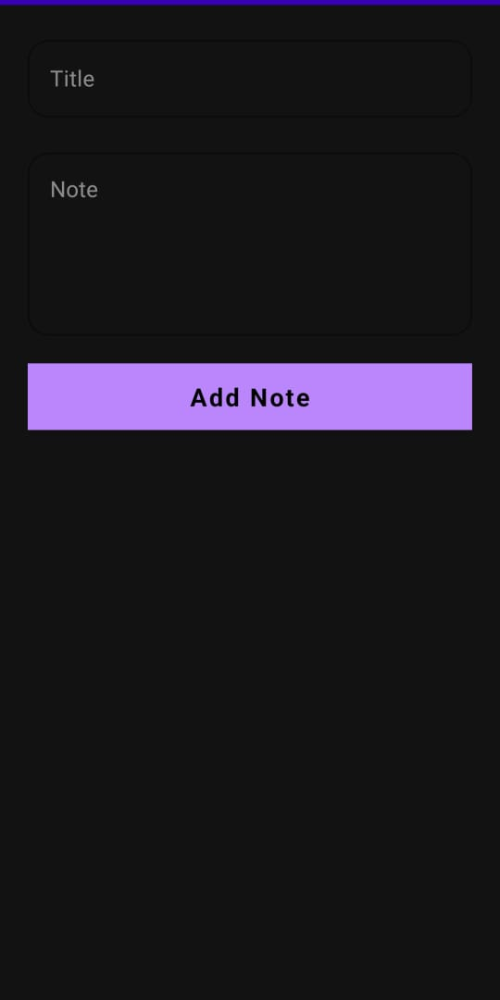
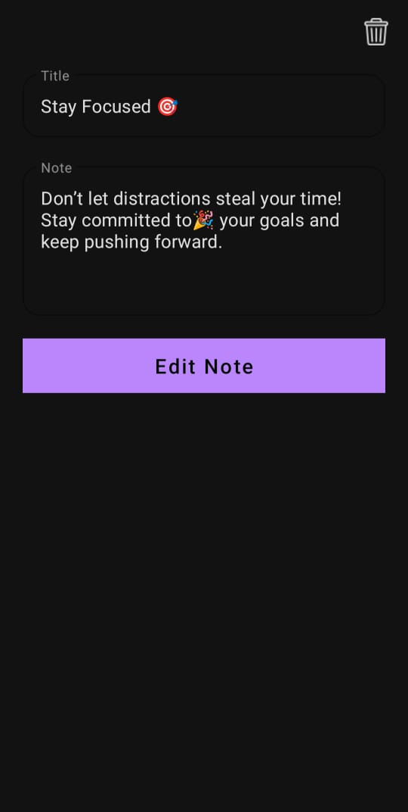

# 📝 Android Notes App

A clean, minimal, and fully functional Notes application built using Kotlin for Android. This app allows users to easily create, update, and delete their notes. It supports both **Light** and **Dark** themes to enhance readability and user comfort.

---

## ✨ Features

- ➕ Add new notes with title & description
- ✏️ Edit existing notes
- 🗑️ Delete notes with confirmation
- 🌙 Dark mode and ☀️ Light mode support
- 💾 Offline functionality (no internet required)
- 📱 Responsive design across various screen sizes
- 🔄 Real-time updates to the note list after edits

---

## 📸 Screenshots

| Light Mode | Dark Mode |
|------------|-----------|
|  |  |
|  |  |
|  |  |


---

## ⚙️ Installation

To run this project on your local machine:

1. **Clone the Repository**
```bash
git clone https://github.com/yourusername/notes-app.git
